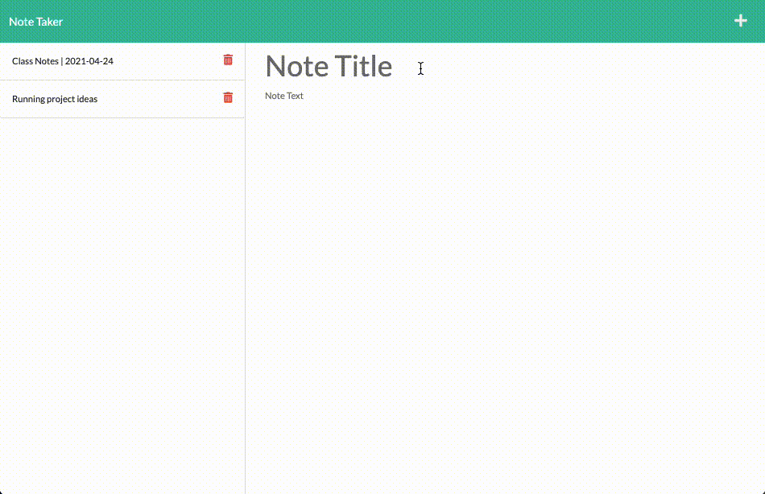

# note-taker

## Description

The ***note-taker*** application is an Javascript server-based application that takes user text inputs in the form of "notes" and writes them to a file for storage and retrieval.  

## Requirements

The application must be able to:

* Write user-entered data to a file (`.json`) when the user enters data in the required fields (title, note body) and clicks the "Save" icon
* Display previously saved notes by their title when the page is loaded and after a new note is saved
* Display the contents of a previously saved note, including it's title, when the note title is clicked
* Assign each user-entered note record a unique ID using the [uuid](https://www.npmjs.com/package/uuid) package
* Delete note records when the respective delete icon is clicked by the user

Application authors must utilize server routes and api requests using fetch or ajax to display saved notes, create new saved notes and delete existing notes.

Since the application must run on a server, the application must be deployed using a cloud service such as [Heroku](https://www.heroku.com/).

## How To Use

#### Getting Started and Creating a New Note

1. [Access the deployed application, served by Heroku](https://note-taker-civils.herokuapp.com/)
2. Click "Get Started"
3. In the field labeled "Note Title," enter the name of the note to be entered
4. In the field labeled "Note Text," enter the contents of the note
5. In the top right corner, click the disk icon
    * **The note is saved and is displayed in the saved note landing area on the left side of the page**

#### Deleting a Note

1. From the saved note landing area on the left side of the page, find the note title to be deleted
2. Click the small trash icon to the right of the note title
    * **The note is deleted and is no longer displayed in the saved note landing area on the left side of the page**

#### Display Saved Note Contents

1. From the saved note landing area on the left side of the page, find the note title to be displayed
2. Click the note title
    * **The note title and contents are displayed**

## Usage

## Future Enhancements

* Add toast message to display when new note is added and when existing note is deleted
* Allow for note contents to use edit tools (font sizes, bold, italics, hyperlinks, lists, etc.) for better formatting
    - Allow for notes to be written using [Markdown](https://www.markdownguide.org/)

## Application Access

* **GitHub Repository**:  [monstertruckdog/note-taker](https://github.com/monstertruckdog/note-taker)
* **Deployed (*Heroku*)**:  [note-taker](https://note-taker-civils.herokuapp.com/)
